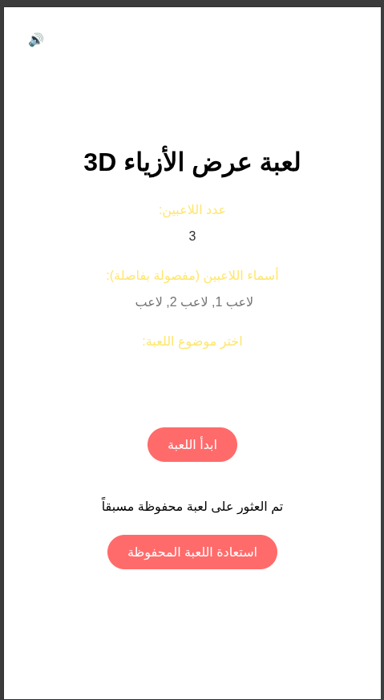
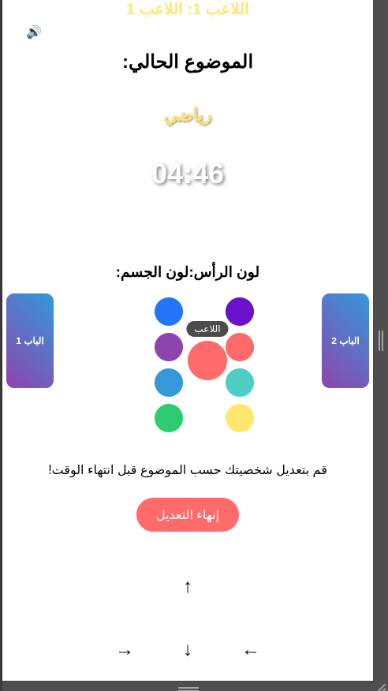
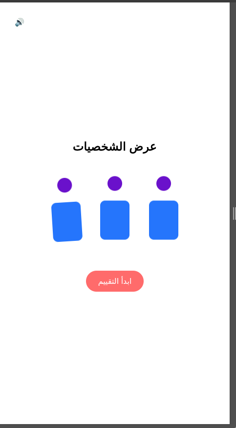
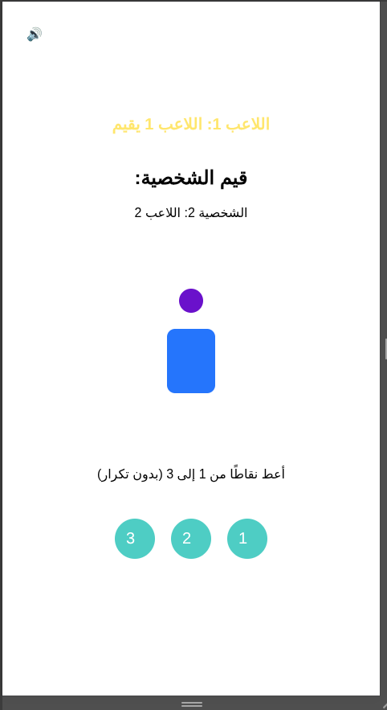
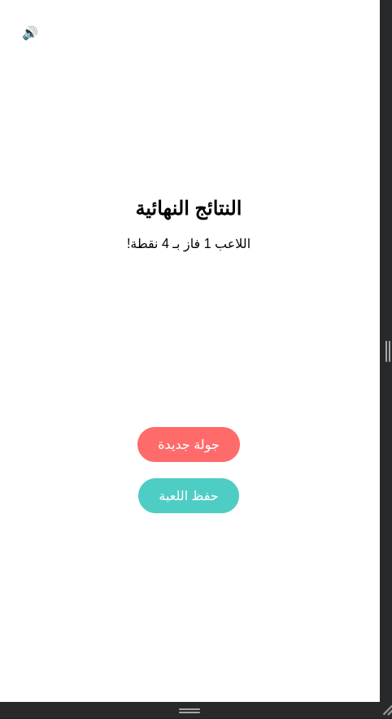

# 🎮 StyleQuest - 3D Fashion Show Game

Welcome to **StyleQuest**, a fun and interactive **3D Fashion Show
Game** 🕺💃\
Players customize their avatars based on a given theme, showcase their
style, and rate each other to find the ultimate winner!\
This project is built with **HTML, CSS, and JavaScript** ✨

------------------------------------------------------------------------

## 🚀 Features

-   ⏱️ **5-minute timer** for each player to customize their avatar.\
-   🎭 **Customizable avatars** (head & body colors).\
-   🚪 **Interactive doors** that open when players get close.\
-   💃 **Extra animations** (dancing / jumping).\
-   🗳️ **Fair rating system**: each player assigns unique points (1 to
    number of players).\
-   🏆 **Final results** with ranking and winner announcement.\
-   💾 **Auto-save & resume** game progress.\
-   🔊 **Sound effects** powered by Web Audio API.

------------------------------------------------------------------------

## 📂 Project Structure

    .
    ├── index.html
    └── static
        ├── css
        │   └── style.css
        ├── js
        │   └── script.js
        └── screen_shot
            ├── 1.png   # Start screen
            ├── 2.png   # Avatar customization
            ├── 3.png   # Showcase
            ├── 4.png   # Rating screen
            └── 5.png   # Final results

------------------------------------------------------------------------

## 🖼️ Screenshots

### 🟢 Start Screen

### 🎨 Avatar Customization

### 👗 Showcase

### ⭐ Rating

### 🏆 Final Results

------------------------------------------------------------------------

## 🛠️ Technologies Used

-   **HTML5**: User interface structure.\
-   **CSS3**: Modern responsive design with animations.\
-   **Vanilla JavaScript**: Game logic, timers, animations, rating, and
    sounds.

------------------------------------------------------------------------

## 🎯 How to Play

1.  Choose number of players, names, and theme 🎭.\
2.  Each player gets **5 minutes** to customize their avatar.\
3.  After time is up, all avatars are showcased.\
4.  Players rate each other (from 1 to number of players).\
5.  Scores are added and the **winner is announced** 🏅.

------------------------------------------------------------------------

## 🌍 Live Demo

🔗 [Try the game here!](https://stylequest.onrender.com)

------------------------------------------------------------------------

## 📦 Repository

🔗 [GitHub Repo](https://github.com/Ashref2004/StyleQuest-)

------------------------------------------------------------------------

## 💡 Future Improvements

-   Add **more outfits & accessories**.\
-   Use **3D models with Three.js**.\
-   Support **multiplayer online mode**.\
-   Implement a **global leaderboard**.

------------------------------------------------------------------------

## 👨‍💻 Developer

Made with ❤️ by **Achraf**\
📌 [GitHub Profile](https://github.com/Ashref2004)

------------------------------------------------------------------------
